# Dokumentacja

Pełna dokemntacja projektu zawierająca:
- Technologie
- Diagramy Data Flow - DFD
- Diagramy Stanów - STD
- Diagramy Bazy Danych - ERD

# Technologie

## Database

### MongoDB

## Backend

### Dependencies

1. **bcrypt** (`^5.1.1`)
   - Biblioteka do hashowania haseł. Używana do bezpiecznego przechowywania haseł użytkowników.

2. **bcryptjs** (`^2.4.3`)
   - Alternatywa dla bcrypt, napisana całkowicie w JavaScript, używana do hashowania haseł.

3. **cloudinary** (`^2.2.0`)
   - Usługa do zarządzania zasobami w chmurze, głównie do przechowywania obrazów.

4. **cookie-parser** (`^1.4.6`)
   - Middleware dla Express do obsługi ciasteczek (cookies).

5. **cors** (`^2.8.5`)
   - Middleware dla Express do obsługi Cross-Origin Resource Sharing (CORS), umożliwiający dostęp do zasobów z innych domen.

6. **dotenv** (`^16.4.5`)
   - Narzędzie do zarządzania zmiennymi środowiskowymi, ładuje zmienne z pliku `.env` do `process.env`.

7. **express** (`^4.19.2`)
   - Minimalistyczny framework dla Node.js do budowy aplikacji webowych i API.

8. **jsonwebtoken** (`^9.0.2`)
   - Biblioteka do tworzenia i weryfikacji JSON Web Tokens (JWT), używana do autoryzacji.

9. **mongoose** (`^8.4.0`)
   - ORM dla MongoDB, ułatwiający interakcję z bazą danych.

### DevDependencies

1. **nodemon** (`^3.1.1`)
   - Narzędzie do automatycznego restartowania aplikacji Node.js podczas zmiany plików w trakcie developmentu.

## Frontend

### Dependencies

1. **@tanstack/react-query** (`^5.39.0`)
   - Biblioteka do zarządzania stanem i cachowaniem danych pochodzących z API w aplikacjach React.

2. **react** (`^18.2.0`)
   - JavaScriptowa biblioteka do budowy interfejsów użytkownika.

3. **react-dom** (`^18.2.0`)
   - Pakiet umożliwiający integrację Reacta z przeglądarką (DOM).

4. **react-hot-toast** (`^2.4.1`)
   - Biblioteka do wyświetlania powiadomień w aplikacjach React.

5. **react-icons** (`^5.2.1`)
   - Kolekcja ikon dla aplikacji React.

6. **react-router-dom** (`^6.23.1`)
   - Biblioteka do routingu w aplikacjach React.

### DevDependencies

1. **@types/react** (`^18.2.66`)
   - Typy TypeScript dla React.

2. **@types/react-dom** (`^18.2.22`)
   - Typy TypeScript dla React DOM.

3. **@vitejs/plugin-react** (`^4.2.1`)
   - Plugin dla Vite umożliwiający integrację z React.

4. **autoprefixer** (`^10.4.19`)
   - Narzędzie do automatycznego dodawania prefiksów CSS dla różnych przeglądarek.

5. **daisyui** (`^4.11.1`)
   - Komponenty UI dla Tailwind CSS.

6. **eslint** (`^8.57.0`)
   - Narzędzie do analizy kodu, zapewniające zgodność z ustalonymi standardami kodowania.

7. **eslint-plugin-react** (`^7.34.1`)
   - Plugin ESLint dla React, zapewniający dodatkowe reguły specyficzne dla Reacta.

8. **eslint-plugin-react-hooks** (`^4.6.0`)
   - Plugin ESLint dla React Hooks, zapewniający dodatkowe reguły specyficzne dla hooków.

9. **eslint-plugin-react-refresh** (`^0.4.6`)
   - Plugin ESLint dla React Refresh.

10. **postcss** (`^8.4.38`)
    - Narzędzie do transformacji CSS z pomocą pluginów.

11. **tailwindcss** (`^3.4.3`)
    - Framework CSS oparty na narzędziach (utility-first CSS framework), pozwalający na szybkie stylowanie.

12. **vite** (`^5.2.0`)
    - Szybki i nowoczesny bundler do aplikacji webowych, wspierający m.in. React i inne frameworki.

# Diagramy Data Flow - DFD

## Auth Controller

Opis działania:
- signup: Użytkownik wysyła dane rejestracyjne (username, fullName, email, password). Serwer sprawdza poprawność danych, hashuje hasło, tworzy nowego użytkownika i generuje token JWT.
- login: Użytkownik wysyła dane logowania (username, password). Serwer sprawdza poprawność danych, generuje token JWT i zwraca dane użytkownika.
- logout: Użytkownik żąda wylogowania. Serwer usuwa token JWT.
- authCheck: Sprawdzenie stanu uwierzytelnienia użytkownika. Serwer zwraca dane użytkownika bez hasła.

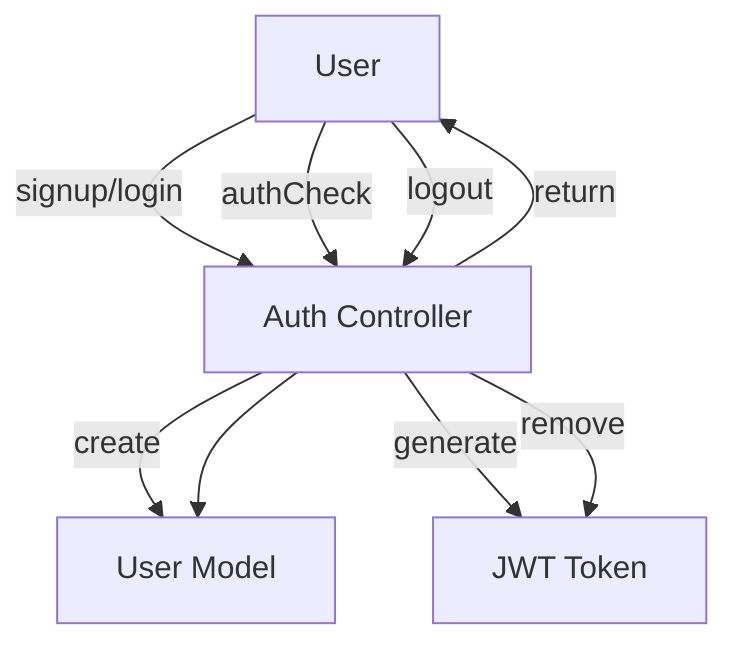

## User Controller

Opis działania:
- getUserProfile: Pobranie profilu użytkownika na podstawie username.
- getSuggestedUsers: Pobranie sugerowanych użytkowników do obserwowania.
- followOrUnfollowUser: Obserwowanie lub przestanie obserwować użytkownika.
- updateUser: Aktualizacja danych użytkownika.

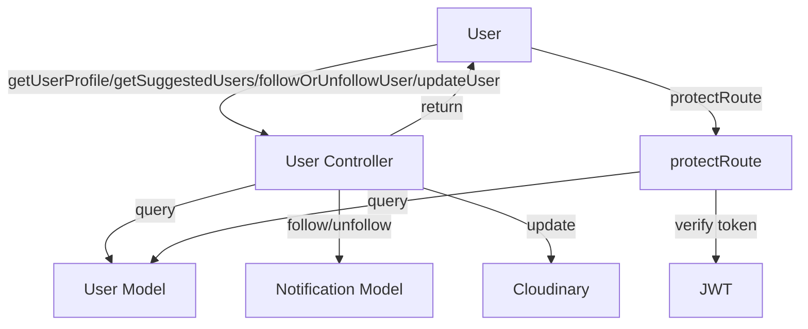

## Post Controller

Opis działania:
- getAllPosts: Pobranie wszystkich postów.
- getFollowingPosts: Pobranie postów obserwowanych użytkowników.
- getLikedPosts: Pobranie polubionych postów użytkownika.
- getUserPosts: Pobranie postów konkretnego użytkownika.
- createPost: Utworzenie nowego postu.
- likeOrUnlikePost: Polubienie lub odlubienie postu.
- commentPost: Dodanie komentarza do postu.
- deletePost: Usunięcie postu.

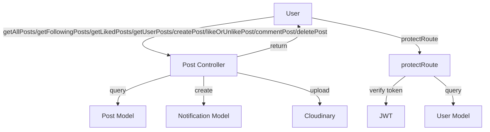

## Notification Controller

Opis działania:
- getNotifications: Pobranie powiadomień użytkownika.
- deleteNotifications: Usunięcie powiadomień użytkownika.

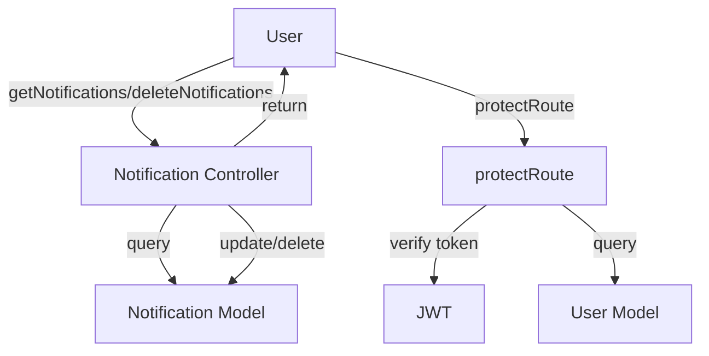

## Funkcja protectRoute - Middleware

Opis działania:
- protectRoute: Sprawdza, czy żądanie zawiera token JWT. Jeśli token jest ważny, użytkownik jest uwierzytelniany i ma dostęp do chronionych zasobów. W przeciwnym razie zwracany jest błąd autoryzacji.

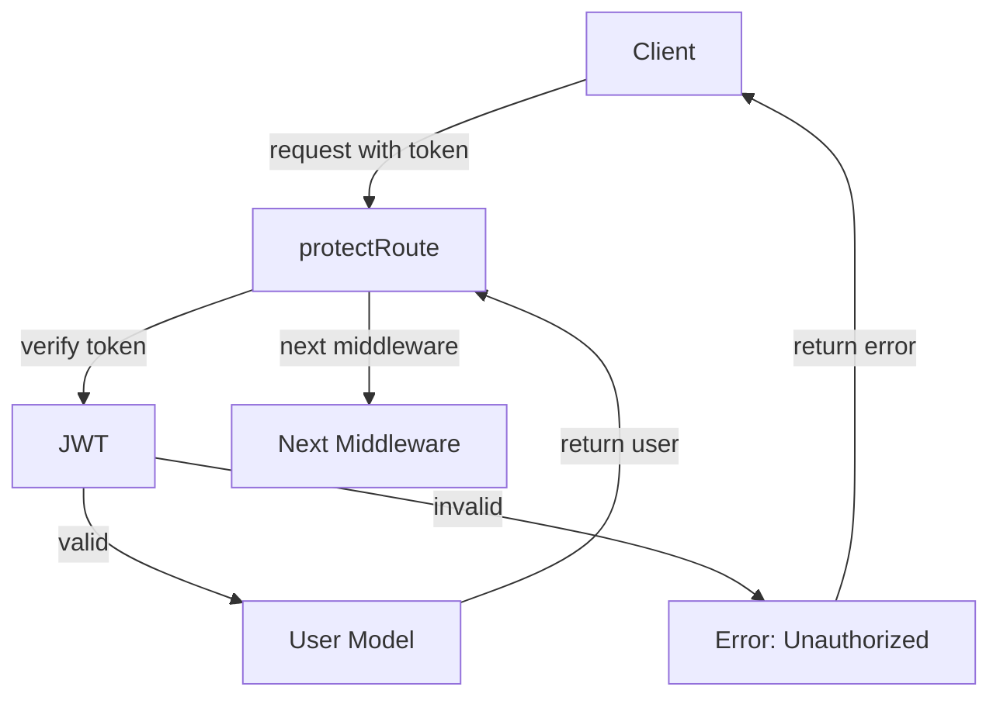

# Diagramy Stanów - STD

## Auth Controller

Stany:
- Idle: Stan początkowy, oczekiwanie na żądanie.
- Authenticating: Przetwarzanie danych logowania lub rejestracji.
- Authenticated: Użytkownik jest zalogowany.
- Unauthenticated: Błąd autoryzacji.

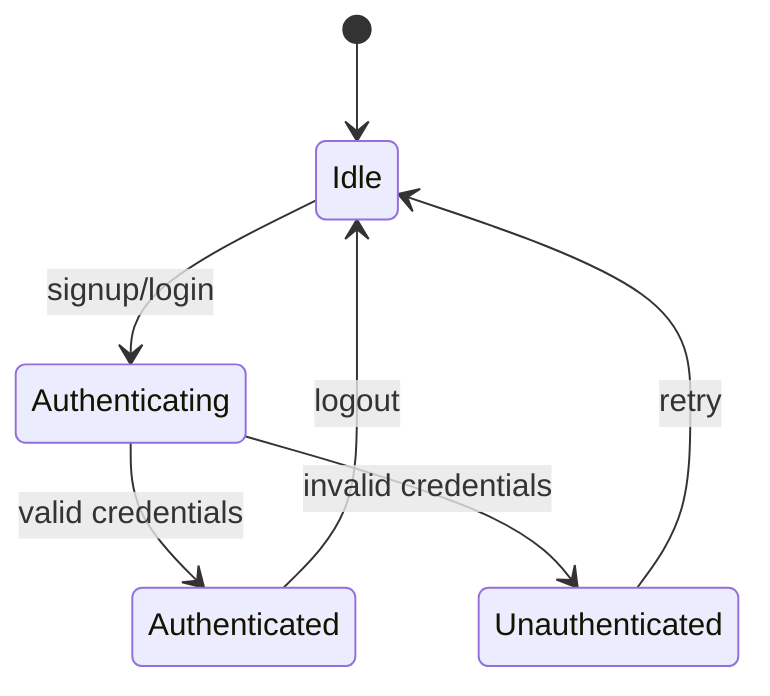

## User Controller

Stany:
- Idle: Stan początkowy, oczekiwanie na żądanie.
- FetchingProfile: Pobieranie profilu użytkownika.
- ProfileFetched: Profil użytkownika pobrany.
- FetchingSuggestions: Pobieranie sugerowanych użytkowników.
- SuggestionsFetched: Sugerowani użytkownicy pobrani.
- UpdatingProfile: Aktualizacja profilu użytkownika.
- ProfileUpdated: Profil użytkownika zaktualizowany.

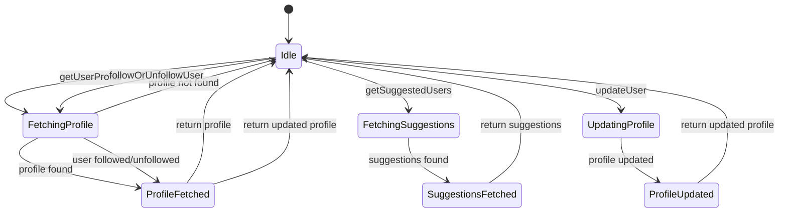

## Post Controller

Stany:
- Idle: Stan początkowy, oczekiwanie na żądanie.
- FetchingPosts: Pobieranie postów.
- PostsFetched: Posty pobrane.
- CreatingPost: Tworzenie nowego postu.
- PostCreated: Post utworzony.
- UpdatingPost: Aktualizacja postu (polubienie, komentarz).
- PostUpdated: Post zaktualizowany.
- DeletingPost: Usuwanie postu.

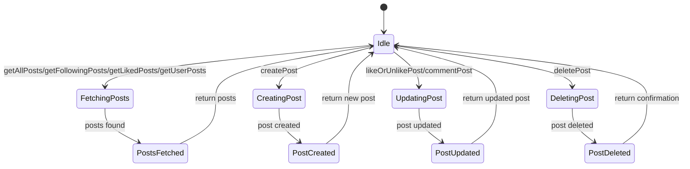

## Notification Controller

Stany:
- Idle: Stan początkowy, oczekiwanie na żądanie.
- FetchingNotifications: Pobieranie powiadomień.
- NotificationsFetched: Powiadomienia pobrane.
- DeletingNotifications: Usuwanie powiadomień.
- NotificationsDeleted: Powiadomienia usunięte.

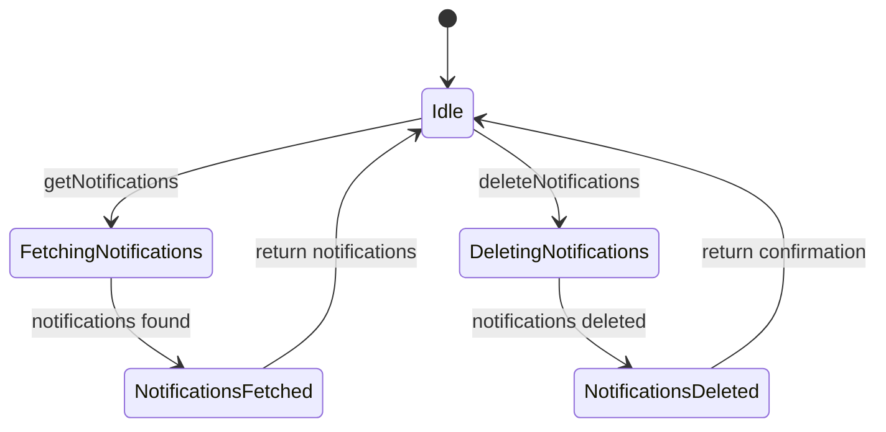

## Funkcja protectRoute - Middleware

Stany:
- Idle: Stan początkowy, oczekiwanie na żądanie.
- VerifyingToken: Weryfikacja tokenu JWT.
- TokenValid: Token jest ważny.
- TokenInvalid: Token jest nieważny.

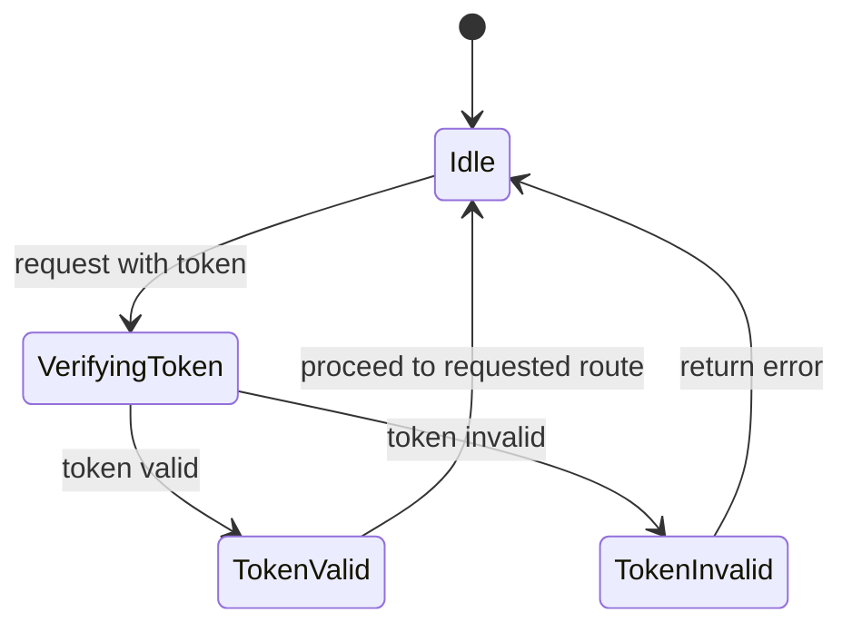

# Diagram Bazy Danych - ERD

## Encje i ich atrybuty

### 1. User

- username: String, required, unique
- fullName: String, required
- password: String, required, minlength: 6
- email: String, required, unique
- followers: [ObjectId], ref: "User", default: []
- following: [ObjectId], ref: "User", default: []
- profileImg: String, default: ""
- coverImg: String, default: ""
- bio: String, default: ""
- link: String, default: ""
- likedPosts: [ObjectId], ref: "Post", default: []

### 2. Post

- user: ObjectId, ref: "User", required
- text: String
- img: String
- likes: [ObjectId], ref: "User", default: []
- comments: [ { text: String, required, user: ObjectId, ref: "User", required } ]

### 3. Notification

- from: ObjectId, ref: "User", required
- to: ObjectId, ref: "User", required
- type: String, required, enum: ["follow", "like"]
- read: Boolean, default: false

## Relacje

- User posiada wiele followers i following, które są referencjami do innych użytkowników.
- User może mieć wiele likedPosts, które są referencjami do postów.
- Post jest powiązany z jednym user, który go utworzył, oraz może mieć wiele likes i comments, które są referencjami do użytkowników.
- Notification jest powiązane z jednym from użytkownikiem i jednym to użytkownikiem.

## Diagram 

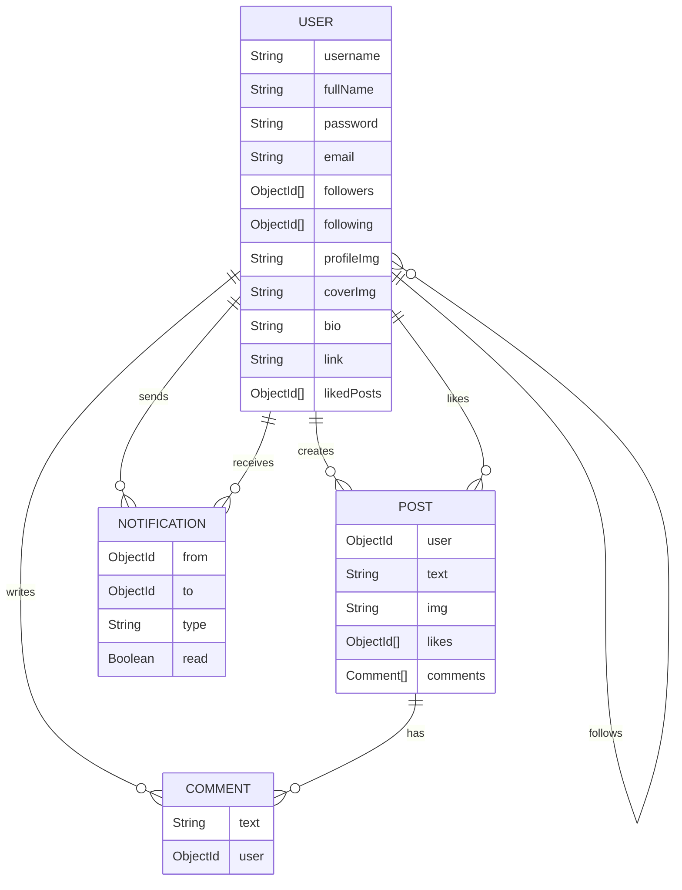
